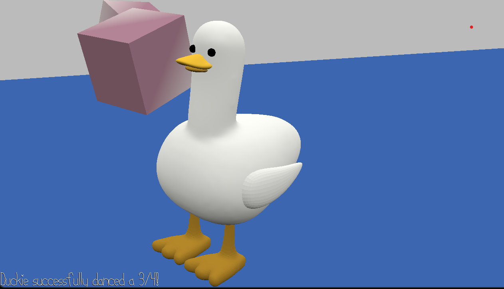

# Duck Steps

Author: Shangyi Zhu

Design: As Duckie the duck, you are learning how to step on the strong beats in a weird 3/4 dance music. 
There are 8 measures in total, with 3 beats in each. The number of measures and where the strong beats are at 
are modifiable in PlayMode.cpp, allowing flexible changes for the 3/4 music track. As Duckie steps, the error between
the tap and actual time for the strong beat is recorded, and anything within a 120ms window would be counted as a successful step.

The game is at a fixed camera angle, but follows the duck as it moves forward. An exponential smoothing is added
to make the movement less jittery as the duck steps. 

Screen Shot:

How To Play:

Use the space key to tap at the strong beats in each measure.

Here is the cheat sheet if you are not sure where the strong beats are at:
1. S, W, W
2. S, W, W
3. S, W, W
4. W, W, S
5. W, W, S
6. W, W, W
7. S, W, W
8. S, W, W

S for strong, and W for weak.

This game was built with [NEST](NEST.md).
